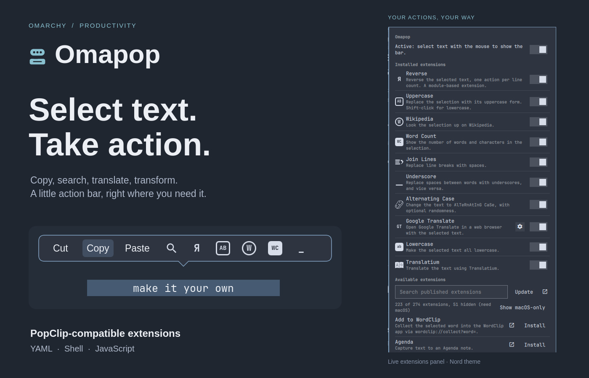

# Omapop

Select text with the mouse and a small bar of actions appears beside it:
**Cut, Copy, Paste, Search, Open Link, Reveal in Files**, plus whatever
extensions you add. Extensions are YAML snippets, shell scripts or JavaScript,
and Omapop supports a reviewed subset of the
[PopClip Extensions Directory](https://www.popclip.app/extensions/).
Browse the approved packages from the bar icon, confirm installation, then
enable the extensions you want to use.



Omapop is a pure Quickshell/QML plugin for the Omarchy shell. The part that
notices "you just finished selecting something" runs inside Hyprland as a small
Lua engine, because the compositor is the only thing on Wayland that sees mouse
button releases and the pointer. No native code, no daemon, no packages to
build.

## Install

```bash
omarchy plugin add https://github.com/jondkinney/omapop.git
omarchy plugin enable io.github.jondkinney.omapop
```

The plugin lands disabled so you can read it first; enabling adds the bar icon
(right section) and starts the service. After changing plugin code, run
`omarchy restart shell` so the shell serves a fresh copy.

Requirements, all already part of Omarchy: Hyprland 0.56 or newer (the Lua
configuration API), Quickshell, `wl-clipboard`, `python3` with PyYAML, `jq`.
JavaScript extensions additionally need `deno` (preferred) or `nodejs`; without
one of them they are listed but disabled.

The standard runtime helpers also use Bash/coreutils, `xdg-utils`, `util-linux`
(`setpriv`), OpenSSL (for catalog signatures), D-Bus, and GLib's `gdbus`. Editable-field detection additionally
uses `python-gobject` and `at-spi2-core`; if those optional bindings are missing,
the accessibility helper reports unknown editability and the usual fallback
rules apply. Omapop never installs these dependencies automatically.

## Remove

```bash
omarchy plugin disable io.github.jondkinney.omapop
omarchy plugin remove io.github.jondkinney.omapop
rm -rf ~/.config/omapop      # your extensions and settings, if you want them gone too
```

Removing the plugin also removes its Hyprland binds the next time Hyprland
reloads its configuration (`hyprctl reload`), or immediately with
`hyprctl eval 'if __omapop then for _, h in ipairs(__omapop.handles) do h:remove() end end'`.

## Using it

- **Select text** by dragging, double-clicking a word or triple-clicking a
  line. The bar appears above the pointer (below when the drag went downwards,
  so it never covers what you selected). In terminal apps that capture mouse
  input, hold **Shift** while selecting. The bar appears promptly after a
  double-click and updates in place if a third click extends the selection.
- **Hover** a button to see its name. **Click** to run it. Hold **Shift**,
  **Ctrl**, **Alt** or **Super** while clicking for an action's alternate
  behaviour (Alt on Search means an exact-phrase search, Alt on Open Link
  copies the links instead of opening them, Shift on the bundled Uppercase
  makes lowercase).
- **Long-press** is off by default. Enable **Show on long press** in Settings,
  then hold the left button for half a second without moving to show the bar
  with no selection, for example to Paste.
- The bar hides when you click elsewhere, press a key, scroll, move the pointer
  away, or switch window or workspace. Hold **Super** while selecting to keep
  it away.
- **Click the bar icon** to turn extensions on and off, edit their options,
  rescan the extensions folder or open it. Click the **Settings cog** at the top of
  the panel to change Omapop's preferences. **Right-click** pauses and resumes
  Omapop.
- Set a **keyboard shortcut** in Settings (for example
  `SUPER + SHIFT + P`): click **Record**, press the combination, and release
  the keys to save. **Escape** cancels recording; **Clear** disables the shortcut.
  The shortcut shows the bar for the current selection, useful in apps
  that do not update the selection until you release the mouse. A bar opened
  this way takes keyboard focus: Left/Right or Tab move, Return runs, Down opens
  a submenu, Up or Backspace goes back, 1 to 9 run a button directly, Escape
  hides. Focus returns to the app before the action runs so pastes land in it.

Open **Omapop's bar icon → Settings** to change selection behavior, search,
and other preferences. Switches and dropdowns save immediately; text fields
save on Enter, when you leave the field, or when you close the page. The shell
saves these preferences in Omapop's entry in `~/.config/omarchy/shell.json`
and applies them automatically.

Under **Excluded apps**, choose **Add from running windows…** and search for
an app or window title. Selecting a window ignores its whole application;
click **×** beside an entry to remove it, even after that app has closed.
The terminal list remains an advanced text field with common terminals filled in.

If you hide the bar icon, you can still open the settings screen with
`omarchy-shell io.github.jondkinney.omapop settings` and turn the icon back on.

For scripts and dotfiles, the same preferences are available through
`omarchy bar set`:

```bash
omarchy bar set io.github.jondkinney.omapop longPress false --json
omarchy bar set io.github.jondkinney.omapop shortcut 'SUPER + SHIFT + P'
```

Replace `false` with `true` to enable long-press. Use `--json` for boolean and
number values; omit it for text values. The available setting keys are:

| Setting | Key | What it does |
|---|---|---|
| Search engine, Custom search URL | `searchEngine`, `searchUrl` | Where the Search button goes. `other` uses your URL with `***` in place of the text. |
| Drag threshold | `dragThreshold` | How far the pointer must move between press and release to count as a drag. |
| Bar position | `position` | `auto` (above the pointer, below when the drag went downwards), `above` or `below`. |
| Assume unknown fields are editable | `assumeEditable` | Off by default. See "When each button appears". |
| Detect editable fields via accessibility | `accessibilityProbe` | Keeps a small AT-SPI helper running and turns on the session accessibility flag. |
| Hide when pointer moves away | `hideDistance` | Distance in pixels. |
| Show on long press | `longPress` | Off by default. When enabled, hold the left button half a second to show the bar without a selection. |
| Largest selection read | `maxSelectionKiB` | Selections larger than this (KiB) are ignored. |
| Excluded apps | `excludedApps` | Window classes where the bar never appears. |
| Terminal window classes | `terminalClasses` | Windows that paste with Ctrl+Shift+V and cannot cut. |
| Extensions' `command` key maps to | `commandKey` | Global default for synthetic macOS Command shortcuts: Ctrl or Super. Individual extensions can override it. |
| Allow extension installs | `extensionDownloads` | Off by default. Allows confirmed installation of reviewed versions, including bundled Linux ports. |
| Keep the extension catalogue up to date | `directoryRefresh` | Fetch the published listing weekly. Contacts popclip.app; this refresh cannot approve packages or change pinned versions. |
| Keyboard shortcut | `shortcut` | A Hyprland bind that shows the bar for the current selection. |
| Show icon in the bar | `showBarIcon` | Hide the icon if you only want the popup. The settings screen stays reachable through the command above. |

Extension options (an extension's own per-action settings) are edited from the
gear next to the extension in the widget panel.

That gear also contains **Command key**: **Use global setting**, **Ctrl**, or
**Super**. The global default remains Ctrl. This changes shortcuts the extension
sends to an application; it does not remap holding Super or Alt while clicking
an action. App-specific combinations such as Control+Command or a terminal's
Ctrl+Shift shortcuts can require a port beyond this single modifier override.

Personal preferences live outside the plugin checkout, so updating the plugin
does not replace them. Keep `shell.json` in your personal dotfiles repository
if your machines share a shell layout. For machines with different layouts,
version a small script of `omarchy bar set` commands to apply just Omapop's
preferences. Installed extension packages and their preferences live under
`~/.config/omapop/`; copy those separately, and exclude secret extension option
values from Git history.

## When each button appears

Every button is filtered against the selection and the window it came from.
Omapop knows three things about the window: its class, whether it is a
terminal, and (when the app is on the accessibility bus) whether the focused
widget is editable. Browsers and Electron apps join the bus only when
accessibility was on before they started, so the first time you enable Omapop
they report "unknown" until restarted; terminals never report.

| Button | Needs |
|---|---|
| Cut | text selected, field editable, not a terminal |
| Copy | text selected |
| Paste | clipboard holds text, and somewhere to paste: an editable field, or a terminal |
| Search | text selected (up to 4000 characters) |
| Open Link(s) | the text contains a URL, or a `spotify:`/`ftp:`-style link |
| Reveal in Files | the whole text is one existing path |
| Install Extension | the text is an extension snippet of at most 5000 characters |
| Extension: replaces the selection (`after: paste-result`, `before: cut`, `requirements: [cut]`) | field editable, not a terminal |
| Extension: pastes (`after: paste`, `before: paste`, `requirements: [paste]`) | clipboard target available (editable field or terminal) |
| Extension: `url`, `show-result`, `copy-result`, key combos | its own `requirements` and `regex` only |
| Long press (no selection) | only buttons that need no text: Paste and extensions with `requirements: [paste]` or `[]` |

Editability is resolved in this order: AT-SPI answer for the focused widget;
terminal window class (pastes work, replacing does not); a list of read-only
viewers and file managers; then the **Assume unknown fields are editable**
setting, which is off by default: text on a web page, in a mail viewer or in
any other app that cannot report its focused field never offers Cut, Paste or
text-replacing actions. The price is that an editable field in an app that is
not on the accessibility bus is treated as read-only too, so:

- Restart Chromium, Electron apps and Firefox once after enabling Omapop. The
  helper turns the session accessibility flag on and they pick it up at start.
  A browser that starts before the shell does (session restore at login) misses
  the flag; for Chromium-based browsers a line with
  `--force-renderer-accessibility` in `~/.config/chromium-flags.conf` (or the
  matching `*-flags.conf`) makes it unconditional.
- GTK and Qt apps report at once. Terminals accept Paste but never replace.
- Turn the setting on if you prefer every action to show, with `paste-result`
  falling back to copying when the field turns out to be read-only.

When a field is not editable, `paste-result` actions that do run fall back to
copying the result.

Other placement rules: the button marked `wants primary display` (Copy and
Paste by default) is centred under the pointer; a `wants initial display`
submenu opens at once with a back button; more buttons than fit in about half
the screen width spill into a "More" page.

## Extensions

Extensions live in `~/.config/omapop/extensions/`. Each one is a
`Name.popclipext/` folder holding a `Config.yaml`, `Config.json`, `Config.js`,
`Config.ts` or `Config.plist` (the format's original XML form, which many older
directory packages still use) plus any icons and scripts it needs.
Use the snippet installer below to turn snippet text into a package; loose
`.popcliptxt` files are listed but cannot be enabled. Four bundled examples ship in the plugin's `extensions/` folder
(Word Count, Wikipedia, Uppercase, Reverse) and show a shell script, a URL, an
inline JavaScript action and a module-based extension.

### From the directory

The bundled [signed catalog](catalog/approved.json) approves **189 exact package
versions**: 95 upstream releases and 94 Omapop variants. The
[original review](catalog/REVIEW.md) covers all 276 published downloads evaluated
on 2026-09-08. The [Linux port report](ports/REPORT.md) resolves the 98 entries
that needed work: 85 ports, 9 explicit web alternatives, 2 blocked and 2 dropped.

1. Open **Settings → General → Allow extension installs**. This is off by default.
2. Return to **Available extensions** and choose **Install → Confirm install**.
3. The package appears under installed extensions, **disabled**. Read its
   description and requirements, configure any options, then enable its switch.

After upgrading, previously installed user extensions also need explicit
enablement if no content approval was recorded. An older or edited package with
an approved identifier must be replaced with the approved version first.

Approved metadata is available offline. **Show unapproved** also displays the
optional cached directory listing for inspection; those entries cannot be
installed through Omapop. **Update** and the weekly refresh only refresh this
listing. New approvals require a trusted Omapop release.

Installation verifies Omapop's catalog signature, then the downloaded archive's
SHA-256 **before extraction**, followed by every extracted file and the package's
identity/version before publication. If the publisher changes a download at the
same URL, installation fails until that version is reviewed and approved.
PopClip's embedded signatures are retained as package data; Omapop does not
claim to verify them.

Omapop ports install from archives bundled with this plugin and use separate
identifiers and provenance. Their hashes cover our modified bytes. See the
[port setup guide](ports/README.md) for personal API tokens, Linux dependencies,
manual web handoffs and the limits of offline validation.

The explicit terminal installer also works with the shell stopped:

```bash
cd ~/.config/omarchy/plugins/io.github.jondkinney.omapop
python3 bin/omapop-directory.py search markdown
python3 bin/omapop-directory.py install 09a521
python3 bin/omapop-directory.py refresh
```

`install` accepts an approved shortcode, identifier, extension page URL or
package URL. It enforces the same signed approval policy and leaves the package
disabled. `search --all` includes cached unapproved entries; `classify` collects
their action-type metadata. IPC supports directory browsing through
`dirsearch <query>`, `dirresults`, `dirshowmac <0|1>` (the legacy name for
showing unapproved entries), and `dirrefresh`. Installation and action execution
have no IPC command.

Installation never overwrites an existing package, empty folder or symlink.
To reinstall, explicitly move the old package out of the extensions folder
first. An edited package with an approved identifier fails the content check.
For your own reviewed fork, use a new identifier and install it manually.

Manual packages and snippets remain supported, with an explicit trust notice
and enablement step. They are not approved by the catalog. New or changed
content starts disabled, and user packages are checked again before each action
or module population. Enabling an unknown script means trusting it to run as you.

### From a snippet

A snippet is a short extension written as text that starts with `#popclip`.
Select one anywhere, on a web page, in a chat, in a README, and the bar offers
**Install Extension "Name"**. Clicking it asks for confirmation; a snippet that
carries code (a shell script, JavaScript, an interpreter, a module or key
combos) says so in the question. Nothing is installed until you accept.

```yaml
#popclip
name: Say Hello
icon: square filled Hi
after: show-result
javascript: return "Hello, " + popclip.input.text
```

Snippets are stored as a package folder under the extensions folder and start
disabled. Review the code, then enable the installed entry. Editing it requires
reviewing and enabling the new content again.

### Writing your own

A package is a folder whose name ends in `.popclipext` with a config file at
its root. The bundled Word Count extension is a complete shell-script example:

```yaml
#popclip
name: Word Count
identifier: io.github.jondkinney.omapop.wordcount
description: Show the number of words and characters in the selection.
icon: square filled WC
after: show-result
interpreter: bash
shell mode: none
shell script: |
  words=$(printf '%s' "$POPCLIP_TEXT" | wc -w)
  chars=$(printf '%s' "$POPCLIP_TEXT" | wc -m)
  printf '%s words, %s characters' "$words" "$chars"
```

What the format supports here:

| Area | Supported |
|---|---|
| Action types | `url` (with `clean query`, `spaces as plus`, `{popclip option x}`), `key combo` / `key combos` (with `wait N`), `shell script` / `shell script file` (`interpreter`, `stdin`, `shell mode`), `javascript` / `javascript file`, module extensions (`defineExtension`, `actions`, `action`, `submenu`, population functions with the `dynamic` entitlement) |
| Filtering | `requirements` (`text`, `copy`, `cut`, `paste`, `url`, `isurl`, `urls`, `email`, `emails`, `path`, `option-x=y`, `!` negation, narrowing), `regex`, `required apps` / `excluded apps` (macOS bundle identifiers are mapped onto common Hyprland window classes) |
| Behaviour | `before` and `after` (`copy-result`, `paste-result`, `preview-result`, `show-result`, `show-status`, `popclip-appear`, `copy-selection`, `cut`, `copy`, `paste`, `paste-plain`), `stay visible`, `capture html`, `restore pasteboard`, `show as`, submenus with a back button |
| Icons | text icons with `square`, `circle`, `search`, `filled`, `strike`, `monospaced`, `flip-x`, `flip-y`, `scale`, `rotate`, `move-x`, `move-y`, `preserve-color`; PNG/SVG files up to 1 MiB; inline `svg:` and `data:`; the most common `symbol:` names. `iconify:` icons fall back to initials (no network) |
| Options | `string`, `boolean`, `multiple`, `secret`, `heading`; values reach scripts as `POPCLIP_OPTION_*`, URLs as `{popclip option x}` and JavaScript as `popclip.options` |
| Script variables | `POPCLIP_TEXT`, `POPCLIP_FULL_TEXT`, `POPCLIP_HTML`, `POPCLIP_URLS`, `POPCLIP_EMAILS`, `POPCLIP_PATHS`, `POPCLIP_MODIFIER_FLAGS`, `POPCLIP_BUNDLE_IDENTIFIER` (the window class), `POPCLIP_APP_NAME`, `POPCLIP_EXTENSION_IDENTIFIER`, `POPCLIP_ACTION_IDENTIFIER`, `POPCLIP_OPTION_*` |
| JavaScript API | `popclip.input`, `context`, `modifiers`, `options`, `pasteText`, `copyText`, `performCommand`, `showText`, `showSuccess`, `showFailure`, `showSettings`, `appear`, `pressKey(s)`, `openUrl`, `openTemplateUrl`, `revealFile`; `util` (base64, query strings, hashing, uuid, sleep, locale info); `pasteboard.text`; `print`; `sleep`; `XMLHttpRequest` and a small `require("axios")` with the `network` entitlement; `require` of package-relative `.js`/`.json` files |

Image icons use the theme's foreground color while retaining their original
alpha, including antialiased edges, fine strokes and transparent cut-outs.
SVGs render above the display's physical resolution and are smoothly
downsampled; Qt caches the decoded images by source and size. `preserve-color`
keeps the original colors. There is no tracing step or generated icon cache.

Not available on Linux: AppleScript, macOS Services, Shortcuts, `share()`,
Dictionary and Spelling. `runShellScript` from JavaScript is not implemented
yet; use a shell-script action instead.

Omapop supports `copyContent({"public.rtf": ...})` for RTF clipboard output and
`nativeAction(kind, options)` with the `native` entitlement. Native actions use
fixed Linux operations; printing and running selected Bash code require separate
confirmation. Explicit script previews remain visible until dismissed.

Option values, per-extension key preferences and content-bound enablement are stored in
`~/.config/omapop/settings.json`:

```json
{
  "disabled": ["io.github.jondkinney.omapop.wikipedia"],
  "options": { "com.example.translate": { "language": "de" } },
  "commandKeys": { "com.example.translate": "ctrl" },
  "enabled": {}
}
```

Enabling a user extension records its content digest in `enabled`; an ID alone
cannot enable replacement code. Packages copied to another machine must retain
the same bytes and safe file permissions. Copy the settings too to preserve
explicit enablement, or enable the packages individually on the new machine.

## How it works

1. `Service.qml` pushes `engine.lua` into Hyprland with `hyprctl eval`. The
   install is idempotent: if the engine is already present in Hyprland's Lua
   state (the shell restarted, Hyprland did not) it only refreshes settings and
   never removes or re-registers binds, because `HL.Keybind:remove()` on an
   expired handle crashes Hyprland 0.56. The engine adds non-consuming binds on
   the mouse buttons (the apps still receive every click) and reports presses
   and releases, with the cursor position, the monitor and the active window,
   as `custom>>omapop|...` events on Hyprland's event socket. It also reports
   key presses, scrolling and a pointer that has wandered off while the bar is
   up, so the bar can dismiss itself. `bin/omapop-context.py` stays running
   beside it and answers, over AT-SPI, whether the focused widget of the window
   is editable.
2. A `wl-paste --primary --watch` child reports every change of the primary
   selection. When a left-button release lands next to a selection change (or
   the release ends a drag or a multi-click), `bin/omapop-selection.py` reads
   the selection with a hard byte limit and detects URLs, e-mail addresses,
   existing paths and extension snippets.
3. Built-in actions and the enabled extensions are filtered against the text
   and the window, and `Popup.qml` (a layer-shell surface that never takes
   keyboard focus unless opened from the shortcut) appears above the pointer on
   that monitor.
4. Clicking a button runs it. Pastes and key presses are Hyprland
   `send_shortcut` dispatches aimed at the window that had the selection;
   clipboard writes go through `bin/omapop-clipboard.py`; shell scripts run as
   bounded child processes; JavaScript runs out of process in
   `bin/omapop-runner.mjs` under Deno or Node and talks back over a line-based
   JSON protocol, so extension code never touches the compositor or the shell
   directly.

## Security boundaries

The Omarchy shell is a long-lived process that owns your bar. External inputs
are bounded before parsing, and third-party extension code runs in child
processes. The boundaries, and the contract at each:

- **Selections and the clipboard** are read by `omapop-selection.py`, never by
  the shell. It streams at most the configured maximum (default 256 KiB) plus
  one byte from `wl-paste`, kills the producer past that, applies a 2.5 s
  deadline to every read, and emits one JSON line that the shell length-checks
  again before parsing. A clipboard entry carrying a password manager's
  sensitive-data hint is reported as present but its text is never read, so a
  copied password neither enters the shell nor reaches an extension's
  `pasteboard.text`; Paste still works because the app receives Ctrl+V.
- **Extension configs** are read by `omapop-extensions.py` through a single
  `O_NOFOLLOW` descriptor with a 256 KiB limit, parsed with PyYAML's safe
  loader (or the standard-library plist reader), normalised to a fixed schema
  with capped strings, counts and depth,
  and emitted as JSON the shell caps again. Package-relative file references
  that escape the package are rejected (`realpath` compared against the
  package root); icon files must be regular files of at most 1 MiB before the
  shell's image decoders see them. User-package content verification rejects
  all symlinks, special files and files writable by other users. At most 200
  packages are scanned per folder. YAML/plist aliases are expanded under an 8192-value, 1 MiB
  string-byte budget; cyclic or excessively nested configurations are rejected.
- **Snippet installs** always confirm, and say when the snippet carries code.
  The package is staged as 0600 files in a 0700 directory and published by
  `rename`, so a half-written extension is never scanned.
- **Every child process** has a fixed argv with an absolute executable, a
  private environment (only what is needed to reach the compositor and the
  display), a retained-output limit and a deadline; output is drained while the
  child runs and the child is killed at the limit. Limits count UTF-8 bytes,
  including line delimiters, before buffering or dispatching protocol lines;
  an unterminated line cannot bypass them. Stderr is separately limited to
  16 KiB. Extension shell scripts get
  the environment the extension format defines, a 256 KiB output cap and a
  120 s deadline, and are killed when you click the spinner.
- **Extension JavaScript** never runs in the shell. Under Deno the runner
  starts with `--no-config --no-prompt --no-remote` and read access to the
  package and plugin helpers; under Node it uses `--permission` with the same
  read paths.
  `--allow-net` is added only for extensions that declare the `network`
  entitlement, so the runtime itself enforces it (verified: without the
  entitlement `fetch` and `node:net` fail with a permission error under both).
  No write, run, env or FFI permission is ever granted. The read sandbox is
  confined to the package and helper directories. The shared `fetch`,
  `XMLHttpRequest` and Axios compatibility APIs enforce a 20-second whole-request
  deadline, 1 MiB streamed response cap, 256 KiB request-body cap, four concurrent
  requests and at most five same-origin redirects. HTTPS is required except for
  loopback HTTP services. A network-entitled script can still use native runtime
  networking; this compatibility layer is not a hostile-code containment proxy.
  Effects come back over a JSON line protocol. At most 128 are queued, then
  performed in order after successful process completion. Failed, truncated or
  stale actions discard their queued effects. URLs are
  checked against a scheme allowlist (`javascript:`, `data:` and `vbscript:`
  never open), key combos are parsed into known modifiers and keysyms, paths
  to reveal must be absolute, and every result string is capped and sanitised
  before display.
- **The extension directory** is read by `omapop-directory.py`, never by the
  shell: it fetches only `https://` URLs on four explicit popclip.app hosts,
  port 443, without URL credentials. Every redirect is checked **before** it
  is followed (at most five), with bounded reads and a 20-second total deadline
  across DNS, redirects and the body, and hands the shell
  JSON it caps again. Besides the listing it reads each extension's own page
  once, for the action type, pausing between pages. HTML and catalogue files
  are limited to 4 MiB, catalogues to 500 entries with a fixed display schema.
  Cache files are read through a regular-file, owner-checked, no-follow
  descriptor; writes use private staging and a pinned parent directory.
  Archive downloads are capped at 20 MiB. All entries are checked before any
  decompression: no absolute/traversing/duplicate paths, links, special files
  or encrypted members; at most 500 entries, 16 path levels, 1024 path bytes,
  8 MiB per member and 32 MiB expanded in total. Extraction streams under the
  same limits into private staging. Linux `renameat2(RENAME_NOREPLACE)` publishes
  the package relative to the pinned destination, never replacing an existing
  package. Cleanup is descriptor-relative. An installed package still has to
  pass the scan above before the shell will load it.
- **Approval policy** comes from the bundled catalog, never refreshed HTML or
  the per-user listing cache. A public-key fingerprint pinned in the helper
  anchors an Ed25519 signature over the exact catalog bytes. The helper reads
  at most 2 MiB, verifies through descriptor-backed snapshots with a five-second
  OpenSSL deadline, then parses and validates the schema. Each entry binds an
  identifier, version, download URL, archive SHA-256 and complete file hash list.
  Archive verification happens before extraction; staged-file and identity
  checks happen before publication. User extensions start disabled; enablement
  records a digest of their content. A changed approved package is blocked, and
  all user packages are checked before each action or module population.
  These are point-in-time checks, not isolation from a hostile same-user process
  changing files between verification and execution. The catalog and its key
  update with trusted plugin code; there is no standalone remote rollback policy.
- **The engine** is Lua pushed into Hyprland with `hyprctl eval`. The only
  values injected are clamped integers and one escaped string (the shortcut).
  Its events percent-encode every field with a 240-byte cap per field, and the
  shell decodes, length-caps and strips control and bidi characters from each.
  Key presses go out as structured `hl.dsp.send_shortcut` calls whose
  modifiers, keysym and window address are filtered to fixed alphabets.
- **The accessibility helper** reads only the focus state, role and editable
  flag of the focused widget, never its text, and answers within 300 ms or not
  at all. It turns on the session accessibility flag, which is what makes
  toolkits expose their widget trees to assistive technology; that is a
  same-user surface, and the setting **Detect editable fields via
  accessibility** turns the helper off.
- **Display**: every `Text` showing external strings uses `Text.PlainText`
  after control and bidi characters are stripped and the length is capped.

What is trusted: an installed extension is code that runs as you. It can press
keys in the window that had the selection, read the clipboard through
`pasteboard.text`, open URLs, and, with the `network` entitlement, talk to the
internet. Install extensions the way you would run a script from the same
source. Selected text never leaves the machine unless an action you click opens
a URL, or a network-entitled extension sends it.

## Development

```bash
ln -s "$PWD" ~/.config/omarchy/plugins/io.github.jondkinney.omapop
omarchy plugin validate .
/usr/lib/qt6/bin/qmllint -I /usr/share/omarchy/shell *.qml
python3 -m unittest discover -s tests -p 'test_*.py'   # helpers, directory
node tests/actions.test.mjs
node tests/gestures.test.mjs                        # click timing and stale read callbacks
node tests/settings.test.mjs                        # typed settings and preservation of other preferences
node tests/extension-policy.test.mjs                # ordered effects, opt-in, per-extension preferences
node tests/http.test.mjs                            # request deadlines and streamed byte limits
node tests/runner-http.test.mjs                     # fetch, XHR and Axios through the restricted runner
node tests/runner-modules.test.mjs                  # TypeScript, defaults and dynamic population
python3 tests/check_settings_ui.py                   # controls in an isolated, offscreen Quickshell
lua tests/engine.test.lua                          # modified mouse input and engine reloads
QT_QUICK_BACKEND=rhi QSG_RHI_BACKEND=opengl /usr/lib/qt6/bin/qmltestrunner -platform offscreen -input tests
omarchy restart shell
omarchy-shell io.github.jondkinney.omapop status
```

`omarchy-shell io.github.jondkinney.omapop show` shows the bar for the current
selection; `settings` opens preferences; `hide`, `pause`, `resume` and `toggle`
control its visibility. `status` and `debug` inspect the current state. Rescan
and action execution are available from the UI, not IPC.

See [catalog maintenance](catalog/README.md) for source collection, review
decisions, offline compatibility checks and signing a new approval revision.

## License

MIT, see `LICENSE`.

Omapop is not affiliated with, authorised by, or endorsed by Pilotmoon Software.
PopClip is a product of Nicholas Moore / Pilotmoon Software. Omapop implements
the extension format from the publicly published PopClip developer
documentation (https://www.popclip.app/dev/), which is licensed CC BY-SA 4.0;
this repository carries no text from it. Extensions in the directory are the
work of their own authors and carry their own licenses.
